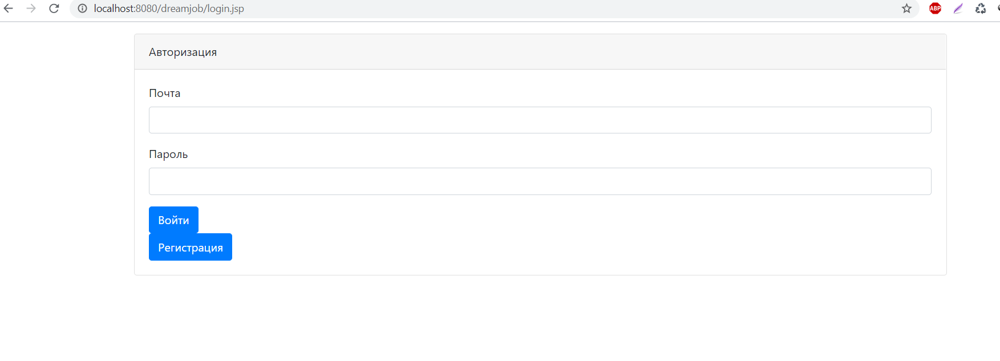
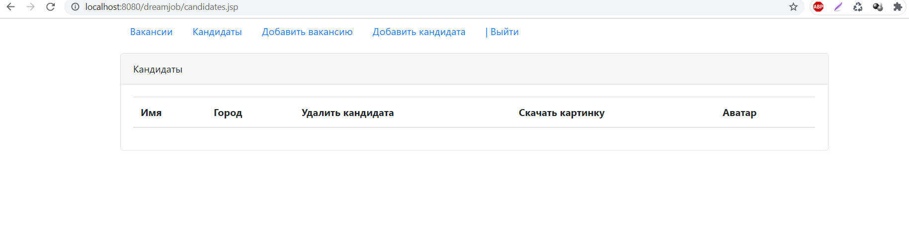
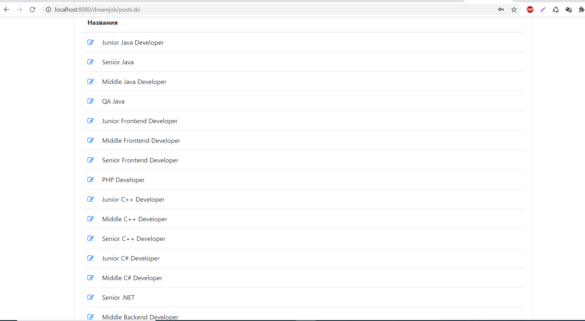
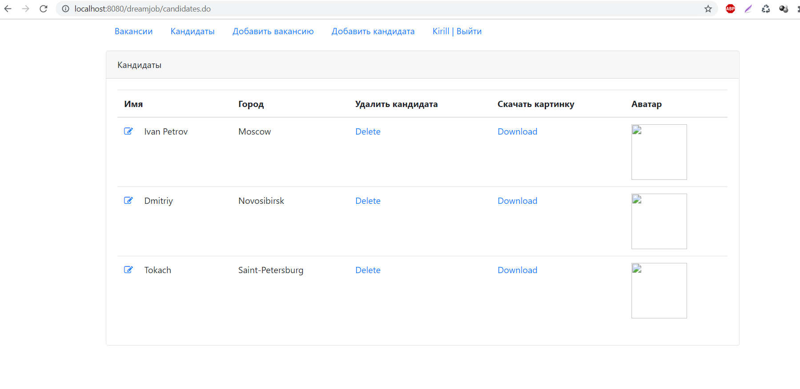

# job4j_dreamjob

# О проекте
<h2>Техническое задание</h2>
Проект для изучения Java EE.

Это приложение - биржа работы.
В системе будут два типа пользователей: кандидаты и менеджеры. Кандидаты будут публиковать резюме. Менеджеры будут публиковать вакансии о работе.
Кандидаты могут откликнуться на вакансию. Менеджер может пригласить на вакансию кандидата.

# Технологии
* Java 15
* Java EE Servlets, JSP, JSTL
* PostgreSQL, JDBC, Liquibase
* JUnit, Mockito, PowerMock
* Maven, Tomcat

# Общая информация 
Основной функционал приложения доступен зарегистрированным пользователям. Новым клиентам доступен раздел регистрации и авторизации. Это достигается за счет фильтрации всех запросов в ru.job4j.dream.filter.AuthFilter. Сам фильтр (и все сервлеты) подключается к проекту в src/main/webapp/WEB-INF/web.xml
Все операции сохранения/изменения/получения пользовательских данных описаны в интерфейсе ru.job4j.dream.store.Store
# Региcтрация
/reg.do
# Адреса
/reg.do /auth.do

# Сервлеты
ru.job4j.dream.servlet.RegServlet ru.job4j.dream.servlet.AuthServlet

# Модели

ru.job4j.dream.model.User

Не авторизованному пользователю доступны только эти страницы.

После успешной авторизации/регистрации пользователь попадает на главную страницу. Здесь отображаются свежие вакансии и новые кандидаты что были добавлены за текущий день. Для выхода из приложения нужно кликнуть на кнопку "выйти" в верхнем меню.

